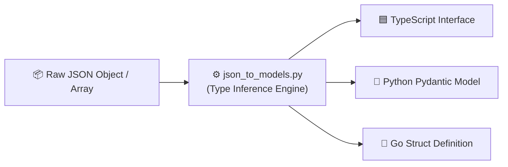

<div align="center">

# 🚀 json-to-models

### *Code model generator: Convert JSON to TypeScript, Pydantic & Go structs.*

[](https://github.com/TauqeerMustafa/json-to-models/actions)
[](LICENSE)
[](https://www.python.org/)
[](json_to_models.py)
[](CONTRIBUTING.md)

<br/>

<p align="center">
  <a href="#-why-use-json-to-models">Why json-to-models?</a> •
  <a href="#-instant-preview">Demo</a> •
  <a href="#-quick-start">Quick Start</a> •
  <a href="#-architecture">Architecture</a> •
  <a href="#-cli-reference">CLI Reference</a> •
  <a href="#-contributing">Contributing</a> •
  <a href="#-license">License</a>
</p>

</div>

---

## 💡 Why Use `json-to-models`?

- **Multi-Target Support**: Generates TypeScript Interfaces, Pydantic `BaseModel` classes, or Go structs.
- **Smart Type Inference**: Accurately infers numbers, booleans, nested lists, and dictionary structures.
- **Instant Copy-Paste**: Output is clean, fully formatted, and ready for your codebase.

---

## 🎬 Instant Preview

```bash
$ python json_to_models.py --lang pydantic --name UserProfile
============================================================
🔄 GENERATED PYDANTIC MODEL: UserProfile
============================================================
from pydantic import BaseModel
from typing import Any, Optional

class UserProfile(BaseModel):
    id: int
    name: str
    active: bool
    skills: list[str]
    meta: dict[str, Any]
============================================================
```

---

## ⚡ Quick Start

```bash
# 1. Clone the repository
git clone https://github.com/TauqeerMustafa/json-to-models.git
cd json-to-models

# 2. Run CLI tool immediately (No pip install required)
python json_to_models.py --help
```

---

## 🏛️ Architecture & Workflow



---

## 💻 CLI Reference

| Command | Description |
| :--- | :--- |
| `python json_to_models.py --help` | Display full help menu and flag options |
| `python json_to_models.py` | Run default execution mode |

---

## 🤝 Contributing

Contributions, feature suggestions, and pull requests are warmly welcomed!
- Read our [Contributing Guidelines](CONTRIBUTING.md).
- Follow our [Code of Conduct](CODE_OF_CONDUCT.md).

---

## 📄 License

Distributed under the **MIT License**. See [`LICENSE`](LICENSE) for details.

<div align="center">
  <sub>Crafted with ❤️ for the open-source community by <a href="https://github.com/TauqeerMustafa">Tauqeer Mustafa</a>.</sub>
</div>
